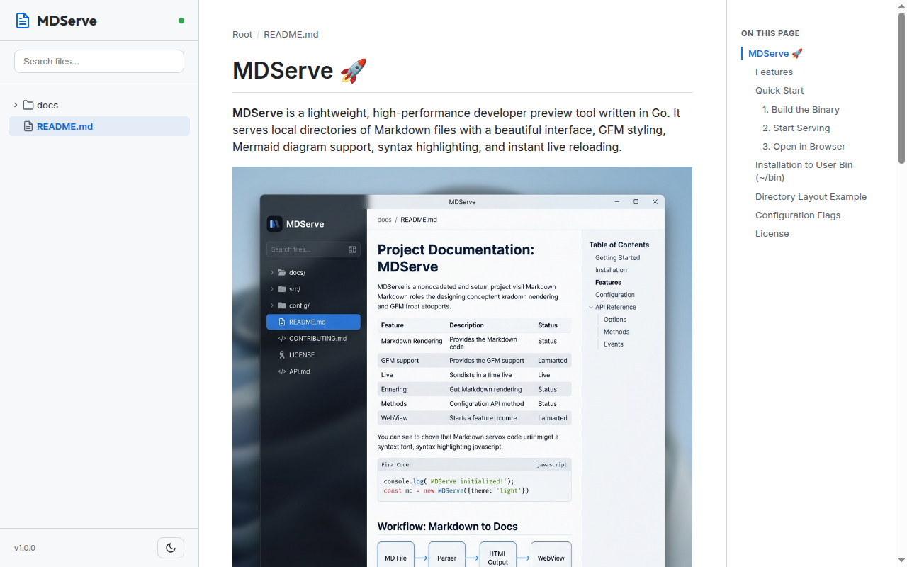

# MDServe 🚀

**MDServe** is a lightweight, high-performance developer preview tool written in Go. It serves local directories of Markdown files with a beautiful interface, GFM styling, Mermaid diagram support, syntax highlighting, and instant live reloading.



---

## Features

- 📁 **Seamless Directory Serving**: Serves any local folder recursively. Automatically renders `README.md` / `index.md` inside directories, or generates a clean file-explorer index.
- 🎨 **GitHub Pages Look & Feel**: Uses styling inspired by GitHub Pages.
- 📊 **Mermaid Diagrams**: Native support for rendering graphical diagrams (`flowchart`, `sequenceDiagram`, `gantt`, etc.) from standard Markdown code blocks.
- ⚡ **Live Reloading**: Instant browser refresh via Server-Sent Events (SSE) when any `.md` file or local image/style changes. No plugin required!
- 🔍 **File Search & Explorer**: An interactive, collapsible sidebar file explorer with real-time fuzzy filter search.
- 🌓 **Sleek Light/Dark Mode**: Smooth transition between light and dark themes that updates the markdown container, sidebar, code highlighting, and Mermaid graphs.
- 🔗 **Extensionless Clean URLs**: Clean route mapping (e.g. `/docs/install` translates automatically to `/docs/install.md`).

---

## Quick Start

### 1. Build the Binary
```bash
go build -o mdserve main.go
```

### 2. Start Serving
Run the server pointing to a directory (defaults to current directory `.`):
```bash
./mdserve -dir=. -port=8080
```

### 3. Open in Browser
Visit [http://localhost:8080](http://localhost:8080) to view your rendered documentation.

---

## Installation to User Bin (`~/bin`)
If you want to keep the devtool globally accessible in your shell:
```bash
mkdir -p ~/bin
go build -o ~/bin/mdserve main.go
```
Ensure `~/bin` is in your `PATH` environment variable.

---

## Directory Layout Example

To see nesting and folder routing in action, expand the **docs** folder in the sidebar on the left or browse these test files:
- [Installation Guide](/docs/installation)
- [GFM Tables & Tasklists](/docs/tables)
- [Mermaid Diagrams Preview](/docs/diagrams)

---

## Configuration Flags

| Flag | Default | Description |
|------|---------|-------------|
| `-dir` | `.` | Directory containing Markdown files to serve |
| `-port` | `8080` | Port to start the web server on |

---

## License

This project is licensed under the Apache License, Version 2.0. See the [LICENSE](LICENSE) file for details.
