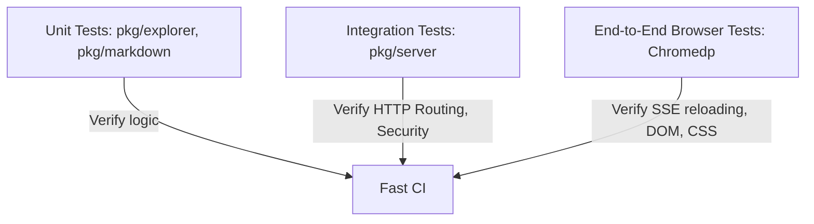

# MDServe Modernization Design Document: Bazel, Refactoring, and Testing

This design document outlines the technical proposal for modernizing the **mdserve** project. It addresses the current UI framework usage, proposes a clean modular architecture, details a Bazel build system integration, and defines a rigorous multi-tiered testing strategy, all while keeping the single Go binary packaging and preserving the exact same look and feel.

---

## 1. Current UI Architecture & Framework Analysis

### Answer to User Question:
**No UI framework (such as React, Vue, or Angular) is used in this project.** 
The user interface is built using standard, framework-less frontend technologies:
* **HTML**: A single template file [templates/main.html](file:///home/red/.gemini/antigravity/worktrees/mdserve/modernize-bazel-testing-binary/templates/main.html) handles directory listings, file views, and 404 pages.
* **CSS**: Embedded directly in a `<style>` block in [templates/main.html](file:///home/red/.gemini/antigravity/worktrees/mdserve/modernize-bazel-testing-binary/templates/main.html).
* **JavaScript**: Embedded directly in a `<script>` block in [templates/main.html](file:///home/red/.gemini/antigravity/worktrees/mdserve/modernize-bazel-testing-binary/templates/main.html). It handles dynamic client-side operations:
  * File tree rendering & collapsible folders
  * Search filtering (collapsing/showing directories dynamically)
  * Dark/Light mode theme switching (persisted via `localStorage`)
  * Server-Sent Events (SSE) `/events` listener to trigger instant hot-reloading when markdown files change.
* **Third-Party Assets**:
  * [github-markdown-css](https://github.com/sindresorhus/github-markdown-css) for markdown styles.
  * [highlight.js](https://highlightjs.org/) for code syntax highlighting.
  * [mermaid.js](https://mermaid.js.org/) for rendering diagrams.
  These assets are downloaded using `go run go/cmd/devtool/main.go vendor`, saved to `third_party/`, and embedded in the Go binary using `//go:embed`.

---

## 2. Proposed Architecture Refactoring (Making App Code Understandable)

Currently, [main.go](file:///home/red/.gemini/antigravity/worktrees/mdserve/modernize-bazel-testing-binary/main.go) is a monolithic file (760+ lines) mixing command-line flag handling, SSE networking, file-system watching, HTML templating, markdown conversion, and HTTP routing.

To make the code readable and easy to maintain for Software Engineers (SWEs), we propose refactoring it into isolated, single-responsibility Go packages and split UI assets.

### Proposed Code Directory Layout

```
├── BUILD.bazel               # Root Bazel build file
├── WORKSPACE                 # Bazel workspace definition (or MODULE.bazel)
├── go.mod                    # Go module file
├── go.sum                    # Go module checksums
├── cmd/
│   └── mdserve/
│       ├── BUILD.bazel
│       └── main.go           # CLI entry point (only flags & initialization)
├── pkg/
│   ├── explorer/             # Crawling filesystem & constructing file trees
│   │   ├── BUILD.bazel
│   │   ├── explorer.go
│   │   └── explorer_test.go
│   ├── markdown/             # Markdown processing & goldmark integration
│   │   ├── BUILD.bazel
│   │   ├── parser.go
│   │   └── parser_test.go
│   ├── server/               # HTTP router, static file serving, SSE, watcher
│   │   ├── BUILD.bazel
│   │   ├── server.go         # Core router and handlers
│   │   ├── sse.go            # SSE connection hub
│   │   ├── watcher.go        # fsnotify directory watcher
│   │   └── server_test.go    # HTTP Integration tests
│   └── ui/                   # UI Assets package
│       ├── BUILD.bazel
│       └── assets.go         # go:embed directive for UI files
├── ui/                       # Frontend source files (extracted from main.html)
│   ├── main.html             # Structurally clean Go template file
│   ├── style.css             # Extracted Vanilla CSS stylesheet
│   └── app.js                # Extracted Vanilla JS logic
├── third_party/              # Vendored external CSS/JS files
└── go/
    └── cmd/
        └── devtool/          # Development helpers
            ├── BUILD.bazel
            └── ...
```

### Decomposing Main.go into Packages

1. **`pkg/explorer` (File Crawler)**
   * Structs: `FileNode`, `DirItem`, `Breadcrumb`.
   * Functions: `BuildFileTree(rootDir string, showAll bool) (*FileNode, error)`, `MakeBreadcrumbs(relPath string) []Breadcrumb`.
   * This isolates OS/filesystem walking and alphabetical folder-first sorting logic.

2. **`pkg/markdown` (Markdown Parser)**
   * Functions: `NewParser() goldmark.Markdown`.
   * Wraps Goldmark dependencies, parser options (like auto-heading IDs), extensions (GFM, Footnotes, Frontmatter), and HTML renderer settings.

3. **`pkg/ui` (Assets Provider)**
   * Coordinates the HTML template parser and assets embedding.
   * Leverages Go's `//go:embed` directive across the `ui/` and `third_party/` directories.
   * Exposes a `GetTemplate() *template.Template` and an `AssetsFS fs.FS` interface to the server.

4. **`pkg/server` (HTTP Server Engine)**
   * Manages HTTP routes, clean paths (preventing path traversal attacks like `../`), 404 responses, and directory views.
   * Houses the SSE **Hub** logic (`newHub`, `run`, `serveSSE`) and **Watcher** logic (`newWatcher`, `watchDir`) utilizing `fsnotify`.

5. **`cmd/mdserve` (Application Entrypoint)**
   * Parses CLI flags (`-port`, `-dir`, `-all`).
   * Bootstraps the parser, the asset filesystem, the SSE hub, the watcher, and kicks off `http.ListenAndServe`.

---

## 3. Bazel Integration Plan

Bazel ensures reproducible, hermetic, and lightning-fast builds and tests. We will use **Bzlmod** (`MODULE.bazel`), which is the modern standard for dependency management in Bazel.

### Step 3.1: Define `MODULE.bazel`
This file defines external rulesets (`rules_go` and `gazelle`) and registers Go toolchains.

```bazel
module(
    name = "mdserve",
    version = "1.0.0",
)

bazel_dep(name = "rules_go", version = "0.46.0")
bazel_dep(name = "gazelle", version = "0.35.0")

go_sdk = use_extension("@rules_go//go:extensions.bzl", "go_sdk")
go_sdk.download(version = "1.25.0")

go_deps = use_extension("@gazelle//:extensions.bzl", "go_deps")
go_deps.module(
    path = "github.com/fsnotify/fsnotify",
    sum = "h1:n+5Wd49TfEs3qi14v7nyz5V5372sGy5t1OKfC1Cdwl0=",
    version = "v1.10.1",
)
go_deps.module(
    path = "github.com/yuin/goldmark",
    sum = "h1:f5yR+p8S3EgiL1j29hIp5zxs74s2Bf1p+ZtP0yq/Zl4=",
    version = "v1.8.2",
)
go_deps.module(
    path = "github.com/yuin/goldmark-meta",
    sum = "h1:1Qcfs73aK7v9sA2P14uU3/A3knd+0X42NIL808u9G+w=",
    version = "v1.1.0",
)
go_deps.module(
    path = "github.com/spf13/cobra",
    sum = "h1:e5/Vx567g1GHjDAAlLwyA51D1ra7CzEGsH05FsqFNg0=",
    version = "v1.10.2",
)
use_repo(
    go_deps,
    "com_github_fsnotify_fsnotify",
    "com_github_yuin_goldmark",
    "com_github_yuin_goldmark_meta",
    "com_github_spf13_cobra",
)
```

### Step 3.2: Root `BUILD.bazel`
The root build file configures Gazelle for automatically generating and updating Go build rules.

```bazel
load("@gazelle//:def.bzl", "gazelle")

# gazelle:prefix mdserve
gazelle(name = "gazelle")

gazelle(
    name = "gazelle-update-repos",
    args = [
        "-from_file=go.mod",
        "-to_macro=deps.bzl%go_dependencies",
        "-prune",
    ],
    command = "update-repos",
)
```

### Step 3.3: Packages `BUILD.bazel` Examples

For **`pkg/ui/BUILD.bazel`**:
Go files in this package will embed the static files (`ui/*` and `third_party/*`). We declare these files as dependencies using the `embedsrcs` attribute.

```bazel
load("@rules_go//go:def.bzl", "go_library")

go_library(
    name = "ui",
    srcs = ["assets.go"],
    embedsrcs = [
        "//ui:main.html",
        "//ui:style.css",
        "//ui:app.js",
        "//third_party:github-markdown.min.css",
        "//third_party:highlight-github.min.css",
        "//third_party:highlight-github-dark.min.css",
        "//third_party:highlight.min.js",
        "//third_party:mermaid.min.js",
    ],
    importpath = "mdserve/pkg/ui",
    visibility = ["//visibility:public"],
)
```

For **`cmd/mdserve/BUILD.bazel`**:
```bazel
load("@rules_go//go:def.bzl", "go_binary", "go_library")

go_library(
    name = "mdserve_lib",
    srcs = ["main.go"],
    importpath = "mdserve/cmd/mdserve",
    visibility = ["//visibility:private"],
    deps = [
        "//pkg/markdown",
        "//pkg/server",
        "//pkg/ui",
    ],
)

go_binary(
    name = "mdserve",
    embed = [":mdserve_lib"],
    visibility = ["//visibility:public"],
)
```

---

## 4. Rigorous Multi-Tiered Testing Strategy

To ensure code health, prevent regressions, and enforce security, testing will be divided into three rigorous tiers.



### Tier 1: Package Unit Tests
These check pure functions in isolation with no network or filesystem side-effects.
* **Markdown rendering tests**: Convert markdown snippets (footnotes, links, GFM tables) to HTML strings and check contents.
* **Breadcrumb generation tests**: Verify `/docs/design/footnotes` translates to three breadcrumbs: `["Root" (/), "docs" (/docs), "design" (/docs/design), "footnotes" (/docs/design/footnotes)]`.
* **Clean Path checks**: Feed malicious strings like `../../etc/passwd` or `//..//..` to verify the path cleaner rejects them with `Access Denied` status.

### Tier 2: HTTP Integration Tests (`net/http/httptest`)
These verify routing, templates, and request lifecycles.
* **Extensionless MD serving**: Send GET requests to `/docs/installation`. Verify the server locates `/docs/installation.md` under the hood and responds with HTTP 200 containing rendered HTML.
* **Raw file downloads**: Send GET to `/docs/installation?raw=true` and confirm the server returns raw, unmodified markdown.
* **Security enforcement**: Attempt path traversal HTTP requests and verify they receive a `403 Forbidden` response.
* **SSE Connections**: Establish a GET request to `/events` and assert that the response starts with `data: connected\n\n`.

### Tier 3: End-to-End Headless Browser Tests (`chromedp`)
These tests spin up a live server and run a headless Chrome instance to simulate a real user interacting with the UI.

* **DOM and CSS Validation**:
  * Verify CSS elements are loaded (e.g., that body backgrounds match theme colors).
  * Assert that the file tree is loaded, and clicking folder arrow elements collapses/expands children in the DOM.
  * Input letters into the search box and verify that matching files remain visible while others get `display: none` applied.
* **Live SSE Hot-Reload Test**:
  1. The test creates a temporary directory containing `test.md`.
  2. Starts the server pointing to that temporary directory.
  3. Launches `chromedp` to load `http://localhost:<port>/test.md`.
  4. Reads the DOM element representing the page body.
  5. The test writes new text (e.g. `"Updated Content"`) to `test.md` on the host filesystem.
  6. The `fsnotify` watcher detects the write and triggers the SSE reload event.
  7. The test script waits for Chrome to reload and asserts that the new content `"Updated Content"` is visible in the DOM, validating the entire reload loop.

---

## 5. Single Binary Packaging & Look-and-Feel Preservation

To guarantee a **zero-dependency deployment** (single binary) and preserve the present look-and-feel:
1. **Frontend Assets Integration**:
   Instead of references to internet CDNs, all frontend elements (`github-markdown.min.css`, `highlight.min.js`, etc.) remain vendored locally in `third_party/`.
2. **Go `embed.FS`**:
   The Go `embed` package compiled via Bazel builds these files directly into the data segment of the compiled Go binary.
3. **Template Compilation**:
   The `main.html` layout is parsed once at startup from the embedded asset system. CSS (`style.css`) and JavaScript (`app.js`) files are injected into the template layout or served via `/ui/style.css` and `/ui/app.js` endpoints served out of the same embedded virtual filesystem.
4. **Output**:
   Running `bazel build //cmd/mdserve` generates a single standalone binary. Moving this binary to any offline server and executing it with `-dir <path>` will provide a fully styled, interactive, and responsive markdown server without requiring internet access.

---

## Appendix: UI Framework Selection Analysis & Comparison

This appendix evaluates the suitability of different UI framework options for the **mdserve** project. Rather than focusing on build system configuration, this analysis focuses on three core criteria:
1. **Understandability**: How easily a new software engineer can read, reason about, and modify the frontend code.
2. **Maintainability & Testability**: How robust the codebase is against regressions, how easily it can be refactored, and the effort required to write unit and integration tests.
3. **User Experience (UX) & Rendering Performance**: Initial page load speeds, input responsiveness, and interaction smoothness (particularly for large files, markdown rendering, and big directory structures).

---

### 1. Understandability for Software Engineers (SWEs)

Modern software engineers are highly accustomed to **declarative** UI paradigms, where the UI is a direct function of the state. Imperative programming—manually querying and modifying the DOM—requires tracing execution paths line-by-line.

#### Vanilla JavaScript (Current Pattern)
In the current [templates/main.html](file:///home/red/.gemini/antigravity/worktrees/mdserve/modernize-bazel-testing-binary/templates/main.html), logic is written imperatively. To update the UI state, the script must query the DOM, manipulate classes, and alter CSS properties manually:

```javascript
// Theme Toggling: Manually selecting and mutating multiple DOM properties
function setTheme(mode) {
  document.documentElement.setAttribute('data-color-mode', mode);
  localStorage.setItem('theme', mode);
  
  const themeSunIcon = document.getElementById('theme-sun');
  const themeMoonIcon = document.getElementById('theme-moon');
  const hljsLight = document.getElementById('hljs-light');
  const hljsDark = document.getElementById('hljs-dark');
  
  if (mode === 'dark') {
    themeSunIcon.style.display = 'block';
    themeMoonIcon.style.display = 'none';
    hljsLight.disabled = true;
    hljsDark.disabled = false;
  } else {
    themeSunIcon.style.display = 'none';
    themeMoonIcon.style.display = 'block';
    hljsLight.disabled = false;
    hljsDark.disabled = true;
  }
}
```
* **Understandability Rating: Medium-Low**. A developer must keep a mental map of all HTML element IDs (`theme-sun`, `hljs-light`) and how they relate to CSS states.

#### React & TypeScript
React models this declaratively. The UI structure is defined in a clean, type-safe component, and DOM mutations are handled automatically when state changes:

```tsx
import React, { useState, useEffect } from 'react';

export function ThemeToggler() {
  const [theme, setTheme] = useState(() => localStorage.getItem('theme') || 'light');

  useEffect(() => {
    document.documentElement.setAttribute('data-color-mode', theme);
    localStorage.setItem('theme', theme);
    
    // Manage highlight.js styles
    const lightLink = document.getElementById('hljs-light') as HTMLStyleElement;
    const darkLink = document.getElementById('hljs-dark') as HTMLStyleElement;
    if (lightLink && darkLink) {
      lightLink.disabled = theme === 'dark';
      darkLink.disabled = theme === 'light';
    }
  }, [theme]);

  return (
    <button onClick={() => setTheme(t => t === 'dark' ? 'light' : 'dark')} className="theme-btn">
      {theme === 'dark' ? <SunIcon /> : <MoonIcon />}
    </button>
  );
}
```
* **Understandability Rating: High**. React is the industry standard. Code structure is component-driven, self-contained, and easily readable for any modern SWE.

#### Angular & TypeScript
Angular provides a highly structured, opinionated environment using decorators and components. Modern Angular (v17+) uses **Signals** for fine-grained reactivity and a new control flow syntax:

```typescript
import { Component, signal, effect } from '@angular/core';

@Component({
  selector: 'app-theme-toggler',
  standalone: true,
  template: `
    <button (click)="toggleTheme()" class="theme-btn">
      @if (theme() === 'dark') {
        <svg class="sun-icon">...</svg>
      } @else {
        <svg class="moon-icon">...</svg>
      }
    </button>
  `
})
export class ThemeTogglerComponent {
  theme = signal(localStorage.getItem('theme') || 'light');

  constructor() {
    // Effects react automatically to signal value changes
    effect(() => {
      document.documentElement.setAttribute('data-color-mode', this.theme());
      localStorage.setItem('theme', this.theme());
      
      const lightLink = document.getElementById('hljs-light') as HTMLStyleElement;
      const darkLink = document.getElementById('hljs-dark') as HTMLStyleElement;
      if (lightLink && darkLink) {
        lightLink.disabled = this.theme() === 'dark';
        darkLink.disabled = this.theme() === 'light';
      }
    });
  }

  toggleTheme() {
    this.theme.update(t => t === 'dark' ? 'light' : 'dark');
  }
}
```
* **Understandability Rating: Medium-High**. The strict separation of templates and controller logic makes codebases extremely consistent. However, the framework's API surface (Signals, Dependency Injection, decorators) has a steeper learning curve than React for non-frontend-specialist SWEs.

#### Alpine.js & HTMX
* **Alpine.js** places logic directly in the HTML template attributes (e.g., `<div x-data="{ theme: 'light' }">`). While simple, this scatters JS logic across HTML files, making standard linting, static code analysis, and auto-formatting difficult.
* **HTMX** relies on the Go server returning pre-rendered HTML fragments. It makes client-side logic understandable because the backend Go templates handle the state, but developers must learn to debug dynamic swaps.

---

### 2. Maintainability & Testability

As a codebase grows, maintainability hinges on type safety, modular isolation, and the ability to run fast, hermetic unit tests.

#### Vanilla JavaScript
* **Refactoring Risk**: Very High. If an engineer changes an ID like `id="status-dot"` in the HTML template, the JavaScript will silently fail at runtime with a `TypeError: Cannot set properties of null`. There is no build-time or compile-time check.
* **Testability**: Poor. Testing client-side interactions (like the file-tree collapsible behavior or search input) requires running full integration tests using headless browsers (`chromedp`), which are slower and harder to debug.

```javascript
// Current SSE Event Listener: Prone to silent failures if HTML structure changes
const statusDot = document.getElementById('status-dot');
function connectSSE() {
  const eventSource = new EventSource('/events');
  eventSource.onopen = () => {
    statusDot.className = 'status-dot connected'; // Fails silently if 'status-dot' is renamed/removed
  };
  eventSource.onmessage = (e) => {
    if (e.data === 'reload') location.reload();
  };
}
```

#### React & TypeScript
* **Refactoring Risk**: Extremely Low. TypeScript flags mismatched prop types, missing elements, or syntax issues at compile time. Component boundary lines are strictly defined.
* **Testability**: Excellent. React components can be unit-tested in isolation using frameworks like **Vitest** and **React Testing Library** in milliseconds. You can mock the DOM and verify that clicking a folder node calls the expand callback without needing to boot a Go server or launch a headless Chrome process.

```tsx
// SSE Hook in React: Fully isolated and unit-testable in node environment
export function useLiveReload(sseUrl = '/events') {
  const [status, setStatus] = useState<'connected' | 'disconnected'>('disconnected');

  useEffect(() => {
    const es = new EventSource(sseUrl);
    es.onopen = () => setStatus('connected');
    es.onmessage = (e) => { if (e.data === 'reload') window.location.reload(); };
    es.onerror = () => { setStatus('disconnected'); es.close(); };
    return () => es.close();
  }, [sseUrl]);

  return status;
}
```

#### Angular & TypeScript
* **Refactoring Risk**: Lowest. Angular's strict template checking ensures that template expressions are type-checked against the component TypeScript class. If a variable or method is renamed in TypeScript but not updated in the template, Angular compilation fails immediately.
* **Testability**: Excellent. Angular components can be unit tested using Angular's testing framework (`TestBed`) combined with modern runners like Vitest. Dependency Injection allows services like the SSE reloader to be completely mocked out during tests.

```typescript
// SSE service in Angular: Fully mockable and type-safe
import { Injectable, signal, NgZone } from '@angular/core';

@Injectable({ providedIn: 'root' })
export class LiveReloadService {
  status = signal<'connected' | 'disconnected'>('disconnected');

  constructor(private zone: NgZone) {
    this.zone.runOutsideAngular(() => {
      const es = new EventSource('/events');
      es.onopen = () => this.zone.run(() => this.status.set('connected'));
      es.onmessage = (e) => {
        if (e.data === 'reload') window.location.reload();
      };
      es.onerror = () => {
        this.zone.run(() => this.status.set('disconnected'));
        es.close();
      };
    });
  }
}
```

---

### 3. User Experience (UX) & Rendering Performance

For a markdown-serving application, the user experience is measured by initial load speed, visual stability (no layout shifts), and interface responsiveness during search filtering and navigation.

```mermaid
gantt
    title Initial Load and Render Timeline (Conceptual)
    dateFormat  X
    axisFormat %s

    section Vanilla JS / HTMX
    Server Render HTML           :active, 0, 15
    Browser Render & Style       :crit, 15, 20
    Time-To-Interactive (TTI)    : 20, 21

    section React (SPA)
    Server Render Skeleton       :active, 0, 10
    Download JS Bundle           : 10, 30
    Hydration & React Render     :crit, 30, 45
    Time-To-Interactive (TTI)    : 45, 46

    section Angular (SPA)
    Server Render Skeleton       :active, 0, 10
    Download JS Bundle & Hydrate : 10, 35
    Angular Signals Render       :crit, 35, 48
    Time-To-Interactive (TTI)    : 48, 49
```



#### Vanilla JavaScript
* **Initial Page Load**: Instant. Since the server delivers fully rendered HTML, the browser displays the styled page immediately. There is no hydration delay.
* **Large Document Rendering**: Excellent. Markdown is parsed into HTML on the server (Go side) and rendered directly by the browser.
* **State Updates (File Tree Filter)**: Moderate. Filtering files is handled by iterating through all DOM nodes and setting `node.style.display = 'none'`. On very large directories (thousands of files), this can cause visual stuttering or paint lag.

#### React & TypeScript
* **Initial Page Load**: Slightly Slower. The browser receives an asset skeleton, downloads the compiled JS bundle, runs the react runtime, and hydrates the DOM. For local development servers (which `mdserve` is), this delay is negligible (~100-200ms) but exists.
* **Dynamic Interactivity**: Excellent. Once hydrated, React's Virtual DOM ensures that complex interactions (like fuzzy search filtering over a huge file hierarchy, animating transitions, or navigating tabs) are calculated off-screen and painted in a single layout pass, preventing layout shifts or input lag.

#### Angular & TypeScript
* **Initial Page Load**: Similar to React. Standard hydration cycles apply. Deferrable views (`@defer`) in modern Angular allow chunking resources (like loading mermaid diagram render scripts only when visible), keeping initial package downloads small.
* **Dynamic Interactivity**: Excellent. Modern Angular Signals track dependency changes directly at the DOM-node level rather than executing a tree-wide Virtual DOM diff. This makes Signal-based updates extremely performant when interacting with massive directories or large Markdown files.

#### HTMX
* **Initial Page Load**: Instant. Since the browser receives fully rendered pages directly, initial rendering speed matches Vanilla JS.
* **Dynamic Interactivity**: Laggy on Local actions. Expanding a nested folder or switching a document view requires firing an HTTP request to the Go backend and waiting for the HTML fragment response. Even on localhost, this network hop can create micro-stutters compared to instant client-side updates.

---

## Comparative Evaluation Summary

| Evaluation Dimension | Vanilla JS (Current) | React + TypeScript | Angular + TypeScript | Alpine.js | HTMX |
| :--- | :--- | :--- | :--- | :--- | :--- |
| **SWE Understandability** | **Medium-Low**<br>Imperative DOM manipulation and manual state synchronization. | **High**<br>Declarative component state model; standard industry paradigm. | **Medium-High**<br>Highly organized, but has a higher framework-learning curve. | **Medium**<br>Declarative but logic is embedded in HTML strings. | **High (Go side)**<br>Logic resides in Go server HTML templates. |
| **Refactoring Safety** | **None**<br>Renaming classes or IDs in HTML breaks JS silently at runtime. | **Compile-Time Safe**<br>TypeScript compiler catches template and prop errors. | **Strictly Compile-Time Safe**<br>Angular's strict template checking validates html bindings. | **None**<br>No compile-time check for template attributes. | **Medium**<br>Go html/template offers limited type safety. |
| **Component Testability** | **Difficult**<br>Requires heavy integration/browser tests (`chromedp`). | **Excellent**<br>Fast, isolated DOM-mock unit tests (Vitest). | **Excellent**<br>Powerful unit testing utilities (TestBed/Vitest). | **Poor**<br>Difficult to mock and test attributes in isolation. | **Medium**<br>Tested by asserting Go server route outputs. |
| **Initial Load Performance** | **Instant**<br>Fully server-rendered static HTML page. | **Fast**<br>Slight payload/hydration delay on startup. | **Fast**<br>Slight payload/hydration delay; offset by lazy component loading. | **Instant**<br>Lightweight execution runtime. | **Instant**<br>Server-side rendering. |
| **Interactive Performance** | **High**<br>Fast for simple pages, can degrade on complex DOM trees. | **Excellent**<br>Virtual DOM minimizes browser paints for complex inputs. | **Excellent**<br>Fine-grained Signal reactivity updates DOM nodes directly. | **Medium**<br>Reacts fast but lags on very deep components. | **Network Dependent**<br>Every action requires a server roundtrip. |

---

## Architectural Recommendation & Evaluation

Based on the team's capacity to handle frontend Bazel configurations, we recommend selecting between two clear paths depending on the future roadmap:

### Path A: SPA Framework (React or Angular) + TypeScript (Recommended for Extensibility)
If the project's features are expected to expand beyond a basic viewer (e.g., adding local Markdown file editing, inline annotations, a rich settings menu, or complex tree structures), a compile-time framework is the recommended choice.

* **Choosing between React and Angular**:
  * **Select React** if the team prefers a lightweight library model with simple functions, minimal boilerplate, and an extremely fast ramp-up time for engineers who do not specialize in frontend development.
  * **Select Angular** if the team already develops enterprise systems in Angular, values strict architectural separation of templates/controllers, and wants to leverage Signal-based reactivity and type-safe templates.
  * Both compile cleanly to static assets, which Go embeds directly, preserving the **single Go binary** requirement.

### Path B: Refactored Vanilla JS + CSS (Recommended for Simplicity)
If the server's function will remain 100% focused on serving read-only markdown files with hot-reloads, **Vanilla JS/CSS (separated from HTML)** remains the best option.

* **Why it makes sense**:
  * **Ultra Lightweight**: Zero hydration delay; pages load instantaneously.
  * **Minimal Footprint**: The binary doesn't embed large library packages.
  * **E2E Testing is Sufficient**: Headless browser integration tests (`chromedp`) are enough to verify the 10-15 client-side interactions.

