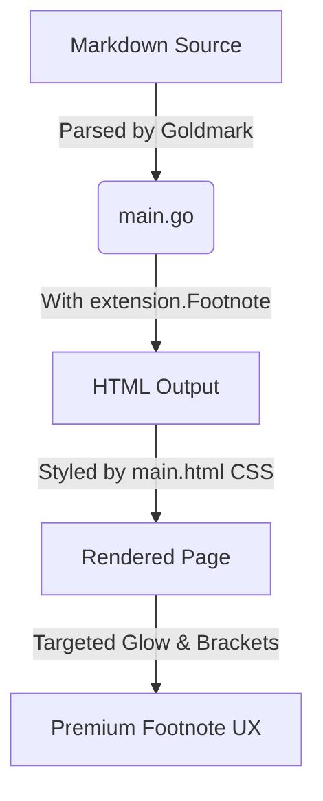

# Design Document: Markdown Footnotes Support

This document outlines the design, standards, UX guidelines, and implementation details for markdown footnotes in `mdserve`.

---

## 1. Markdown Footnote Standards

Because original Markdown (by John Gruber) did not define footnotes, various extended specifications emerged. The three primary specifications governing footnotes are:

### PHP Markdown Extra Syntax
This is the de facto standard for footnotes in the markdown ecosystem:
*   **In-text reference:** `Some text referencing a footnote[^1].`
*   **Footnote definition:** `[^1]: This is the text of the footnote.`
This renders references as superscript anchor links (`<sup><a href="#fn:1">1</a></sup>`) and places the collected list of footnotes inside a `<div class="footnotes">` section at the end of the document.

### GitHub Flavored Markdown (GFM)
In September 2021, GitHub officially added footnotes to GFM, adopting the PHP Markdown Extra syntax. Key characteristics of GFM footnotes include:
*   Adding `data-footnotes` to the footnotes `<section>`.
*   Injecting a screen-reader-only accessible header (`<h2 id="footnote-label" class="sr-only">Footnotes</h2>`).
*   Using specific attributes (`data-footnote-ref`, `data-footnote-backref`) for CSS selectors.

---

## 2. Visual & UX Design Goals

To provide a premium reading experience, footnotes should follow these design principles:

### Context & Flow Preservation
*   **Scroll Margins:** Clicking back-and-forth anchors should scroll smoothly without placing target content under the sticky navigation header. A `scroll-margin-top` offset is applied to reference elements.
*   **Interactive Back-references:** Hovering over back-reference symbols (`↩`) triggers a subtle leftwards slide transition to indicate they return the user to the text.

### Visual Polish
*   **Reference Brackets:** Super-script reference links are automatically wrapped in brackets (e.g. `[1]` instead of just `1`) using CSS pseudo-elements `::before` and `::after`. This makes them clearly recognizable as links rather than standard numbers.
*   **Visual Muting:** The footnotes container uses slightly smaller, secondary-colored typography and is separated from the main content by a clean top border. The redundant browser-native `<hr>` divider is hidden.
*   **Beautiful Target Highlighting:** When a footnote is clicked, the page scrolls and the targeted list item glows with a pulsing background/outline animation before fading out. This helps the reader instantly focus on the correct footnote.

---

## 3. Technical Implementation

The implementation is split between the Markdown parser backend (Go) and the UI styling layer (HTML/CSS).



### Backend Parser (Go)
In [main.go](file:///home/red/ws/mdserve/main.go), we enable the footnote extension within the `goldmark` markdown converter initialization:
```go
mdParser := goldmark.New(
    goldmark.WithExtensions(
        meta.Meta,
        extension.GFM,
        extension.Footnote, // Added to enable footnote parsing
    ),
    // ...
)
```

### CSS Styling Layer (HTML)
In [templates/main.html](file:///home/red/ws/mdserve/templates/main.html), we added custom styles to support both the standard Goldmark-generated tags (`.footnote-ref`, `.footnote-backref`) and GFM classes (`[data-footnote-ref]`, `.data-footnote-backref`):

```css
/* Container styling */
.markdown-body .footnotes {
  margin-top: 48px;
  padding-top: 24px;
  border-top: 1px solid var(--border-color);
  font-size: 0.85em;
  color: var(--text-secondary);
}
.markdown-body .footnotes hr {
  display: none; /* Hide default hr */
}

/* Reference brackets */
.markdown-body .footnote-ref::before { content: "["; }
.markdown-body .footnote-ref::after { content: "]"; }

/* Scrolling margins */
.markdown-body .footnotes li,
.markdown-body [data-footnote-ref],
.markdown-body .footnote-ref {
  scroll-margin-top: 80px;
}

/* Target Glow Animations (Pulsing background/border outline) */
.markdown-body .footnotes li:target {
  animation: footnote-glow 2s ease-out;
  border-radius: 6px;
  padding: 4px 8px;
  margin-left: -8px;
  margin-right: -8px;
}
@keyframes footnote-glow {
  0% {
    background-color: rgba(9, 105, 218, 0.15);
    box-shadow: 0 0 0 2px var(--accent-color);
  }
  100% {
    background-color: transparent;
    box-shadow: 0 0 0 0 transparent;
  }
}
```
*These highlight animations are customized for both light and dark themes using CSS variables (`--accent-color`, `--border-color`).*
