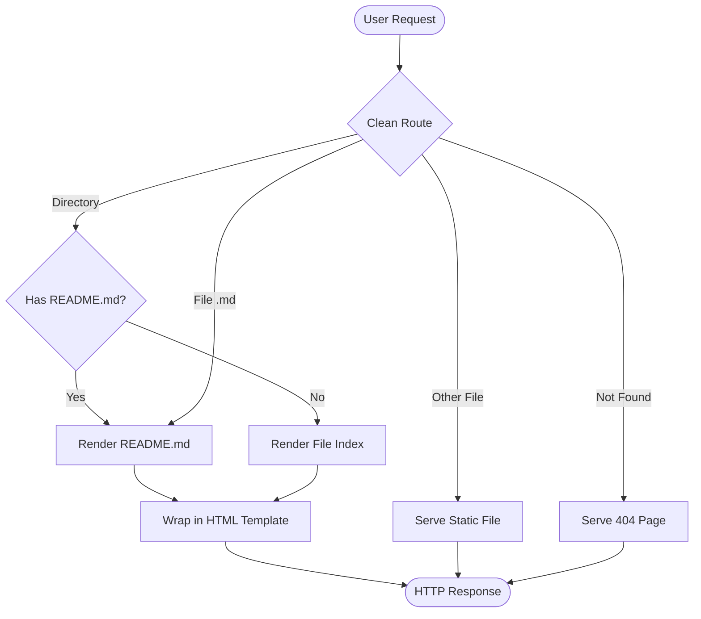
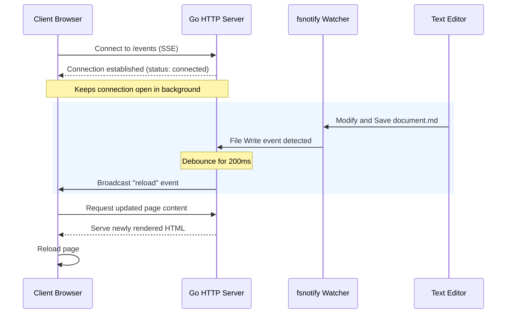
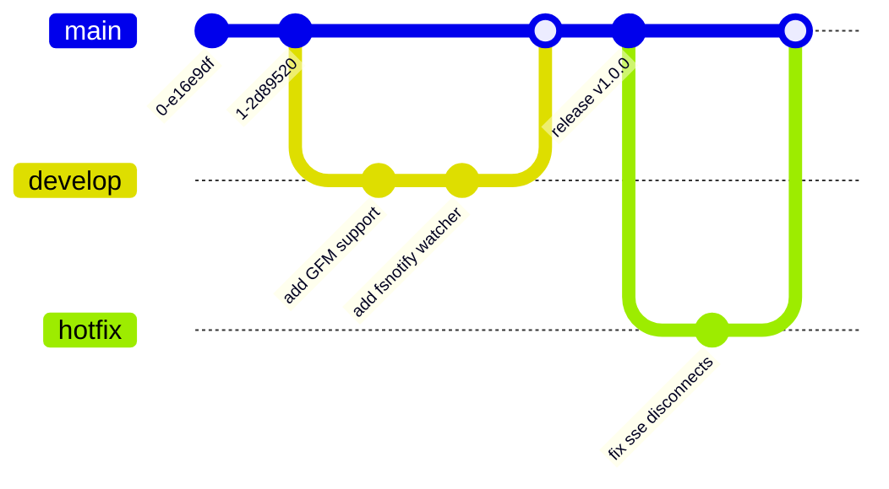

# Mermaid Diagrams Preview

This page tests the integration of **Mermaid.js** within Markdown files. Code blocks with the language set to `mermaid` will be automatically rendered as SVG diagrams in the browser.

## 1. Flowchart Example

Here is a standard flowchart showing the lifecycle of a request in `mdserve`:

## 2. Sequence Diagram Example

This sequence diagram illustrates the live reloading flow via Server-Sent Events (SSE):

## 3. Git Graph Example

Testing Git branching logic using Mermaid:

Verify that all diagrams render graphical SVGs and change their themes correctly when switching between Light and Dark mode!
